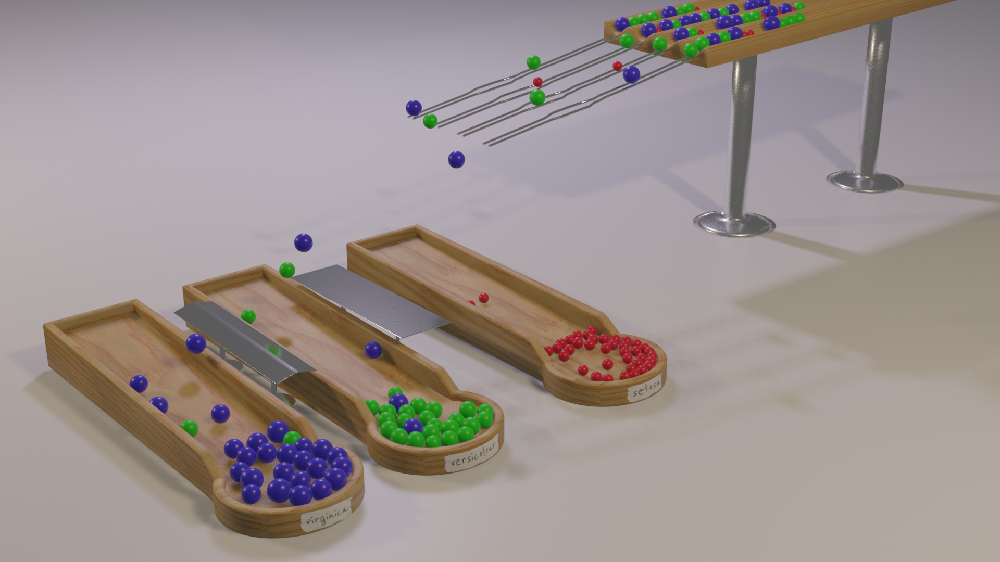

# Iris dataset 3d marbles

Using [Scikit-Learn](https://scikit-learn.org) with [Blender](https://www.blender.org) to render the iris dataset in 3d and create a physical simulation of a marble machine to classify the dataset.

## Installing Scikit-Learn in Blender
