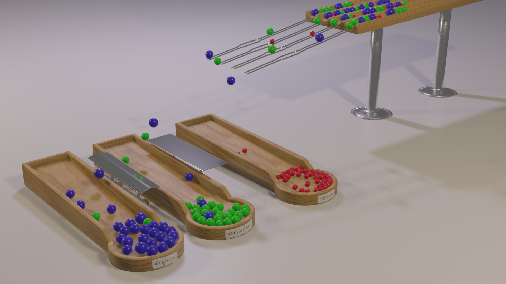

# Iris dataset 3D marbles
What if every row/flower from the [Iris dataset](https://archive.ics.uci.edu/ml/datasets/iris) was represented as a marble in a physics simulation?

Using [Scikit-Learn](https://scikit-learn.org) with [Blender](https://www.blender.org) to render the iris dataset in 3d and create a physical simulation of a marble machine to classify the dataset.


## Installing Scikit-Learn (or any other python library) in Blender
Blender 2.82 comes with python 3.7 and pip already, so you just have to find Blenders' python binary and run it's pip module.

On my mac I found it here:
```bash
cd /Applications/Blender.app/Contents/Resources/2.82/python/bin
```

Then to run that specific python binarys' `pip install` with the following:
```bash
./python3.7m -m pip install scikit-learn
```

I could also see all of Blenders' installed python packages at: `/Applications/Blender.app/Contents/Resources/2.82/python/lib/python3.7`

## Faster animation rendering using Google Cloud
Utilising a [virtual workstation](https://console.cloud.google.com/marketplace/details/nvidia/nvidia-quadro-vws-win2019) for a couple of hours; photo realistic rendering can be achived all in the cloud without having to stress out my old laptop.
